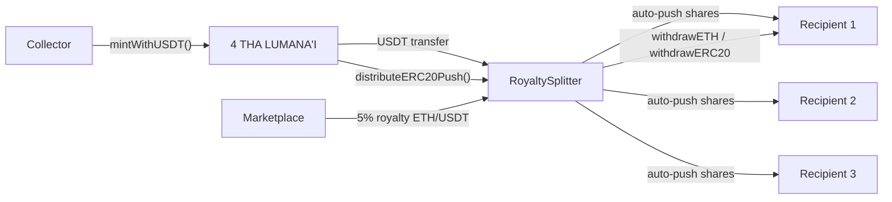

# "4 THA LUMANA'I" — Contract Functionality Reference

Client-facing documentation for the **"4 THA LUMANA'I"** film project smart contracts:

| Contract | Purpose |
|---|---|
| **LumanaNFT** | `"4 THA LUMANA'I"` ERC-721 collection — USDT minting, time-based metadata states, 5% secondary royalties |
| **RoyaltySplitter** | Splits mint revenue and royalties among fixed recipients by predefined shares |

**Stack:** Solidity ^0.8.28 · OpenZeppelin v5.4  
**Deployment model:** The same bytecode is deployed **once per chain**, each carrying one tier, one USDT config, and one price.

---

## Table of contents

1. [System overview](#1-system-overview)
2. [Roles & access control](#2-roles--access-control)
3. [Money flows](#3-money-flows)
4. [LumanaNFT — constants & state](#4-lumananft--constants--state)
5. [LumanaNFT — functions](#5-lumananft--functions)
6. [RoyaltySplitter — constants & state](#6-royaltysplitter--constants--state)
7. [RoyaltySplitter — functions](#7-royaltysplitter--functions)
8. [Events](#8-events)
9. [Typical user journeys](#9-typical-user-journeys)
10. [Sepolia test deployment (reference)](#10-sepolia-test-deployment-reference)

---

## 1. System overview

**Project name:** `"4 THA LUMANA'I"` (on-chain NFT `name()` — set at deployment)

### What the system does

- Collectors **mint NFTs by paying USDT** (`mintWithUSDT`).
- Mint payment is **automatically split** among royalty recipients in the **same transaction** — each recipient receives their share directly in their wallet (push model).
- NFT **metadata changes over time** based on fixed UTC timestamps (3 visual states).
- **Secondary sales** pay a **5% royalty** (EIP-2981) to the RoyaltySplitter. Marketplaces send royalty USDT/ETH to the splitter; recipients claim via pull-based withdrawal (for non-mint paths).

### Architecture

### Standards implemented

| Standard | What it enables |
|---|---|
| **ERC-721** | NFT ownership, transfers, approvals |
| **ERC-2981** | 5% royalty on secondary sales (marketplaces read `royaltyInfo`) |
| **ERC-4906** | Metadata refresh events (`BatchMetadataUpdate`) for indexers/wallets |
| **AccessControl** | Role-based admin and updater permissions |
| **Pausable** | Emergency stop of minting |

---

## 2. Roles & access control

Both contracts use **OpenZeppelin AccessControlDefaultAdminRules**:

- Only **one** address holds `DEFAULT_ADMIN_ROLE` at a time.
- Admin transfer is **two-step** with a **3-day delay** (`ADMIN_TRANSFER_DELAY`).
- After deployment, transfer admin to a multisig using `beginDefaultAdminTransfer` → wait 3 days → `acceptDefaultAdminTransfer`.

### LumanaNFT roles

| Role | Who should hold it | What it can do |
|---|---|---|
| `DEFAULT_ADMIN_ROLE` | Multisig / project owner | Pause minting, set metadata URIs, sweep stray USDT, manage roles |
| `STATE_UPDATER_ROLE` | Cron/automation wallet | Call `triggerMetadataRefresh()` after evolution dates |

### RoyaltySplitter roles

| Role | Who should hold it | What it can do |
|---|---|---|
| `DEFAULT_ADMIN_ROLE` | Multisig / project owner | `rescueERC20()` — sweep unaccounted token surplus only |

---

## 3. Money flows

### Mint revenue (USDT) — automatic push

1. User approves LumanaNFT to spend USDT.
2. User calls `mintWithUSDT(quantity)`.
3. Contract pulls USDT from user → sends to RoyaltySplitter.
4. LumanaNFT calls `distributeERC20Push(usdt)` on the splitter.
5. Splitter **transfers each recipient's share directly to their wallet** in the same transaction.
6. Splitter balance after mint = **0** (nothing left to claim manually).

**Cost formula:**  
`totalPrice = price × quantity × 10^usdtDecimals`  
Example: price = 6200, quantity = 1, 6 decimals → 6,200 USDT (6,200,000,000 smallest units).

### Secondary royalties — pull-based

- Marketplaces read `royaltyInfo(tokenId, salePrice)` → receive splitter address + 5% amount.
- When royalty arrives as **ETH**: splitter's `receive()` credits `pendingETH` per share; recipients call `withdrawETH()`.
- When royalty arrives as **ERC20** (and was not pushed): anyone can call `distributeERC20(token)` to credit `pendingERC20`; recipients call `withdrawERC20(token)`.

### Share split (basis points)

Shares must sum to **10,000 bps (100%)**.  
Sepolia example: 3333 + 3333 + 3334 = 10,000 (~33.33% / 33.33% / 33.34%).  
Rounding dust on push goes to the **last recipient**.

---

## 4. LumanaNFT — constants & state

### Immutable / fixed constants

| Name | Value / meaning |
|---|---|
| `MAX_SUPPLY` | 62 NFTs per deployment |
| `TIER` | 1 = AUMAGA, 2 = TULAFALE, 3 = ALI'I (set at deploy, never changes) |
| `CHRISTMAS_TS` | 1798132800 — metadata state 1→2 (2026-12-25 06:20 NZT) |
| `INDEPENDENCE_TS` | 1811830800 — metadata state 2→3 (2027-06-01 18:20 NZT) |
| `ADMIN_TRANSFER_DELAY` | 3 days |

### Configurable at deploy (immutable after)

| Variable | Description |
|---|---|
| `usdtAddress` | USDT token contract on this chain |
| `usdtDecimals` | USDT decimals (6 on ETH/Polygon, 18 on BSC) |
| `price` | Mint price in whole USDT units (e.g. 6200) |
| `royaltySplitter` | Splitter address — also EIP-2981 royalty receiver |

### Mutable state

| Variable | Description |
|---|---|
| `supply` | Number of NFTs minted so far |
| `baseURIByState[1..3]` | Metadata base URL per visual state (admin-set) |

---

## 5. LumanaNFT — functions

### Public / external — user-facing

#### `mintWithUSDT(uint256 quantity)`

**Who can call:** Any user (when not paused)  
**What it does:**

- Validates quantity > 0 and supply + quantity ≤ 62.
- Checks user has enough USDT balance and allowance.
- Transfers USDT from user → RoyaltySplitter.
- Mints `quantity` NFTs to `msg.sender` (sequential token IDs starting from 1).
- Calls splitter `distributeERC20Push` — **each recipient gets their USDT share in their wallet immediately**.
- Emits `Minted`.

**Prerequisites:** User must `approve(LumanaNFT, totalPrice)` on USDT first.

**Reverts if:** Sold out, paused, zero quantity, insufficient balance/allowance.

---

#### `currentState() → uint8`

**Who can call:** Anyone (view)  
**What it returns:**

| State | Period |
|---|---|
| `1` | Before Christmas timestamp |
| `2` | Christmas → Independence Day |
| `3` | After Independence Day |

Computed live from `block.timestamp` — no admin action required for state transitions.

---

#### `tokenURI(uint256 tokenId) → string`

**Who can call:** Anyone (view)  
**What it returns:** `baseURIByState[currentState()] + tokenId`  
Returns empty string if base URI for current state is not set.  
Used by wallets/marketplaces to fetch metadata JSON.

---

#### `getOwnerTokens(address owner) → uint256[]`

**Who can call:** Anyone (view)  
**What it returns:** Array of all token IDs owned by `owner` (scans IDs 1..supply).

---

#### `tierName() → string`

**Who can call:** Anyone (view)  
**What it returns:** `"AUMAGA"`, `"TULAFALE"`, or `"ALI'I"` based on `TIER`.

---

#### `totalSupply() → uint256`

**Who can call:** Anyone (view)  
**What it returns:** Current mint count (`supply`).

---

### Public / external — admin only

#### `setBaseURI(uint8 state, string uri)`

**Role:** `DEFAULT_ADMIN_ROLE`  
**What it does:** Sets the metadata base URL for visual state 1, 2, or 3.  
**Example:** `"https://.../ipfs/.../metadata/"` → token 5 resolves to base + `"5"`.  
Emits `URIRootUpdated`.

---

#### `triggerMetadataRefresh()`

**Role:** `STATE_UPDATER_ROLE`  
**What it does:** Emits ERC-4906 `BatchMetadataUpdate(1, 62)` so indexers/wallets refresh all token metadata.  
**When to call:** Right after each evolution timestamp (Christmas, Independence Day).  
Does not change on-chain state — only signals off-chain systems.

---

#### `pause()` / `unpause()`

**Role:** `DEFAULT_ADMIN_ROLE`  
**What it does:** Enables or disables minting (`mintWithUSDT` blocked while paused).

---

#### `emergencyPause()` / `emergencyUnpause()`

**Role:** `DEFAULT_ADMIN_ROLE`  
**What it does:** Same as `pause` / `unpause` — alias for emergency use.

---

#### `withdrawUSDT()`

**Role:** `DEFAULT_ADMIN_ROLE`  
**What it does:** Safety recovery — if USDT was sent directly to the NFT contract by mistake, sweeps full balance to splitter and calls `distributeERC20Push` so recipients receive it.  
**Normal operation:** NFT contract should hold **zero USDT** after mints.  
Reverts with `NothingToWithdraw` if balance is 0.

---

### Inherited — ERC-721 (NFT ownership)

These come from OpenZeppelin ERC721 and work as standard:

| Function | Purpose |
|---|---|
| `ownerOf(tokenId)` | Get current owner |
| `balanceOf(owner)` | Count NFTs owned |
| `transferFrom(from, to, tokenId)` | Transfer (caller must be owner or approved) |
| `safeTransferFrom(from, to, tokenId)` | Safe transfer (checks receiver) |
| `approve(to, tokenId)` | Approve one address for one token |
| `setApprovalForAll(operator, approved)` | Approve operator for all tokens |
| `getApproved(tokenId)` | See single-token approval |
| `isApprovedForAll(owner, operator)` | See operator approval |

Minting is **not** pausable for transfers — only `mintWithUSDT` is blocked when paused.

---

### Inherited — ERC-2981 (royalties)

#### `royaltyInfo(uint256 tokenId, uint256 salePrice) → (address receiver, uint256 royaltyAmount)`

**Who calls:** Marketplaces (OpenSea, etc.)  
**What it returns:** `(royaltySplitter, salePrice × 500 / 10000)` → **5%** to splitter address.  
Royalty is the same for every token ID.

---

### Inherited — Access control & admin transfer

| Function | Purpose |
|---|---|
| `hasRole(role, account)` | Check if address has a role |
| `grantRole(role, account)` | Grant role (admin only) |
| `revokeRole(role, account)` | Revoke role (admin only) |
| `beginDefaultAdminTransfer(newAdmin)` | Start 3-day admin handover |
| `acceptDefaultAdminTransfer()` | New admin accepts after delay |
| `cancelDefaultAdminTransfer()` | Cancel pending transfer |
| `defaultAdmin()` | Current admin address |
| `pendingDefaultAdmin()` | Pending new admin (if any) |
| `defaultAdminDelay()` | Returns 3 days |

---

### Inherited — other views

| Function | Purpose |
|---|---|
| `paused()` | Returns true if minting is paused |
| `supportsInterface(id)` | ERC-165 — reports ERC-721, ERC-2981, ERC-4906 support |
| `name()` / `symbol()` | Collection name and symbol (set at deploy) |

---

## 6. RoyaltySplitter — constants & state

### Fixed at deploy (immutable)

| Variable | Description |
|---|---|
| `recipients[]` | List of payout addresses (fixed forever) |
| `shares[]` | Basis points per recipient (must sum to 10,000) |
| `totalShares` | Always 10,000 |

### Accounting state

| Variable | Description |
|---|---|
| `pendingETH[recipient]` | ETH credited but not yet withdrawn |
| `pendingERC20[recipient][token]` | ERC20 credited (pull path) but not withdrawn |
| `totalPendingERC20[token]` | Total ERC20 owed to all recipients for a token |

---

## 7. RoyaltySplitter — functions

### Distribution

#### `distributeERC20Push(IERC20 token)`

**Who can call:** Anyone (typically LumanaNFT during mint)  
**What it does:**

- Measures **new** USDT/token received: `balanceOf(this) - totalPendingERC20[token]`.
- Splits that amount by shares and **transfers each share directly to each recipient's wallet**.
- Last recipient gets any rounding remainder.
- Splitter balance for that amount → **0**.
- Emits `Withdrawn` per recipient and `RoyaltyReceived`.

**Used for:** Mint revenue (called automatically from `mintWithUSDT`).

**Important:** If any recipient cannot receive tokens (blocklist/freeze), the whole transaction reverts. Recipients must be plain EOAs or compatible wallets.

---

#### `distributeERC20(IERC20 token)`

**Who can call:** Anyone (permissionless)  
**What it does:**

- Measures newly arrived token balance (same formula as push).
- **Credits** each recipient's `pendingERC20` — does **not** transfer to wallets.
- Recipients must later call `withdrawERC20`.

**Used for:** Secondary royalty USDT sent directly to splitter (marketplace payments), or manual crediting.

---

#### `receive()` (payable fallback)

**Who can call:** Anyone sending ETH  
**What it does:** Automatically splits incoming ETH across recipients into `pendingETH` (pull model). Emits `RoyaltyReceived`.

---

### Withdrawals (recipients only)

#### `withdrawETH()`

**Who can call:** Any recipient with `pendingETH[msg.sender] > 0`  
**What it does:** Sends all pending ETH to caller. Clears balance.

---

#### `withdrawERC20(IERC20 token)`

**Who can call:** Any recipient with pending balance for that token  
**What it does:** Sends all pending tokens to caller. Updates accounting.

---

#### `withdrawBatch(IERC20[] tokens)`

**Who can call:** Any recipient  
**What it does:** Withdraws all pending ETH **and** all pending amounts for each token in the array — one transaction.

---

### Views

#### `getPendingETH(address recipient) → uint256`

Returns ETH waiting to be withdrawn by that recipient.

#### `getPendingERC20(address recipient, IERC20 token) → uint256`

Returns ERC20 waiting to be withdrawn by that recipient.

#### `getAllPending(address recipient, IERC20[] tokens) → (ethPending, tokenPending[])`

Batch view of ETH + multiple token pending balances.

#### `recipients(uint256 index) → address`

Public getter for recipient address at index.

#### `shares(uint256 index) → uint256`

Public getter for share (basis points) at index.

---

### Admin

#### `rescueERC20(IERC20 token, address to)`

**Role:** `DEFAULT_ADMIN_ROLE`  
**What it does:** Sweeps **surplus only** — tokens in the contract that were **never** credited via `distributeERC20` / `distributeERC20Push` (e.g. accidental transfers, integer dust from pull path).  
**Cannot** touch funds already owed to recipients (`balance - totalPendingERC20`).  
Reverts with `NoSurplus` if nothing to sweep.

---

### Inherited — Access control

Same admin transfer pattern as LumanaNFT (`beginDefaultAdminTransfer`, `acceptDefaultAdminTransfer`, etc.).

---

## 8. Events

### LumanaNFT

| Event | When emitted | Indexed fields |
|---|---|---|
| `Minted(to, quantity, totalMinted)` | After successful mint | `to` |
| `URIRootUpdated(state, uri)` | Admin sets base URI | — |
| `Withdrawn(to, amount)` | Admin sweeps stray USDT | `to` |
| `BatchMetadataUpdate(fromTokenId, toTokenId)` | Metadata refresh triggered | ERC-4906 |

### RoyaltySplitter

| Event | When emitted | Indexed fields |
|---|---|---|
| `RoyaltyReceived(token, amount)` | Funds distributed or received | `token` |
| `Withdrawn(recipient, token, amount)` | Push payout or pull withdrawal | `recipient`, `token` |
| `Rescued(token, to, amount)` | Admin sweeps surplus | `token` |

---

## 9. Typical user journeys

### Collector — mint an NFT

1. Get USDT on the target chain.
2. `USDT.approve(LumanaNFT_address, amount)`.
3. `LumanaNFT.mintWithUSDT(1)`.
4. Receive NFT in wallet; royalty recipients receive USDT shares automatically.

### Project — set metadata before launch

1. Upload metadata JSON to IPFS (one folder per state if needed).
2. Admin: `setBaseURI(1, "https://.../state1/")` (repeat for states 2 and 3).
3. Wallets call `tokenURI(id)` → resolves using live `currentState()`.

### Project — evolution day (metadata refresh)

1. At/after `CHRISTMAS_TS` or `INDEPENDENCE_TS`, cron wallet calls `triggerMetadataRefresh()`.
2. Indexers/wallets receive `BatchMetadataUpdate` and reload metadata (now uses new state's base URI).

### Recipient — claim secondary royalty (ETH)

1. Marketplace sends ETH royalty to splitter (via EIP-2981).
2. Recipient calls `RoyaltySplitter.withdrawETH()`.

### Recipient — claim secondary royalty (USDT, pull path)

1. USDT arrives at splitter from marketplace.
2. Anyone calls `distributeERC20(USDT)` (if not already credited).
3. Recipient calls `withdrawERC20(USDT)`.

### Admin — hand over control to multisig

1. `beginDefaultAdminTransfer(multisigAddress)` on both contracts.
2. Wait 3 days.
3. Multisig calls `acceptDefaultAdminTransfer()` on both contracts.

---

## 10. Sepolia test deployment (reference)

Current testnet deployment (auto-push version):

| Contract | Address |
|---|---|
| MockUSDT | `0x000818578C01a3D8E72918C12d919E5B63576bc2` |
| RoyaltySplitter | `0xe07BB789335F21c18C25Abcb5f729800978Dc57d` |
| LumanaNFT | `0xC97B9207dFe7eFacFDca68D7129170f6590f8E1A` |

**LumanaNFT config (Sepolia):**

| Parameter | Value |
|---|---|
| Name | 4 THA LUMANA'I |
| Symbol | LUMANA |
| Tier | 1 (AUMAGA) |
| Price | 6,200 USDT |
| USDT decimals | 6 |
| Max supply | 62 |
| Royalty | 5% → splitter |

**Royalty recipients (Sepolia):**

| Recipient | Share |
|---|---|
| `0x1249C27810e0244B7cF714926dFbbe154882F353` | 3333 bps |
| `0xdAB13760316369f7868eEbCE145Bf7a69Eb1D521` | 3333 bps |
| `0x07D979D4d9254087EEA22056398f7e36159E50b9` | 3334 bps |

---

## Quick reference — who calls what

| Action | Contract | Function | Caller |
|---|---|---|---|
| Mint NFT | LumanaNFT | `mintWithUSDT(qty)` | Collector |
| Approve USDT spend | USDT | `approve(nft, amount)` | Collector |
| Set metadata URL | LumanaNFT | `setBaseURI(state, uri)` | Admin |
| Refresh wallets after evolution | LumanaNFT | `triggerMetadataRefresh()` | Updater cron |
| Pause mint | LumanaNFT | `pause()` | Admin |
| Recover stray USDT on NFT | LumanaNFT | `withdrawUSDT()` | Admin |
| Auto-split mint payment | RoyaltySplitter | `distributeERC20Push` | Called by NFT |
| Credit marketplace USDT | RoyaltySplitter | `distributeERC20` | Anyone |
| Claim ETH royalty | RoyaltySplitter | `withdrawETH()` | Recipient |
| Claim USDT royalty (pull) | RoyaltySplitter | `withdrawERC20` | Recipient |
| Sweep accidental tokens | RoyaltySplitter | `rescueERC20` | Admin |
| Transfer NFT | LumanaNFT | `transferFrom` / `safeTransferFrom` | Owner |
| Marketplace royalty lookup | LumanaNFT | `royaltyInfo` | Marketplace |

---

*Document version matches contracts in `contracts/LumanaNFT.sol` and `contracts/RoyaltySplitter.sol` as of the auto-push deployment.*
